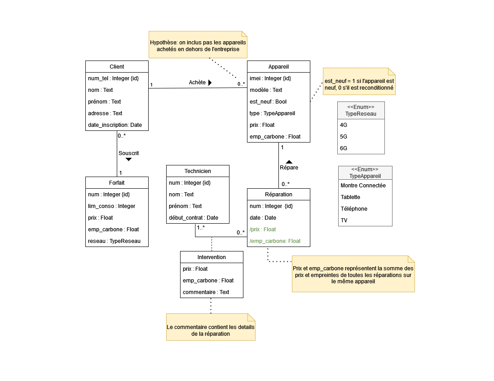

# BD Entreprise Télécommunication

## Aperçu
### Problématique
Clementine Telecom est une nouvelle société de télécommunication. Elle envisage la création d'une base de données pour suivre la consommation de carbone de ses clients, dans le cadre d'une campagne de sensibilisation au réchauffement climatique et aux gaz à effet de serre.

Cette base de données comprendra des informations sur les forfaits proposés, les clients et les appareils achetés, ainsi que les réparations réalisées par les techniciens de Clementine.

Chaque forfait aura un numéro de forfait, une limite de consommation, un prix, une empreinte carbone mensuelle et un réseau (4G/5G..) associé.

Chaque client est identifié par son numéro de téléphone, nom, prénom, adresse et sa date d’inscription chez l’entreprise. Il a forcément un seul forfait.

L’entreprise offre aussi à ses clients des appareils de modèles différents, reconditionnés et neufs, caractérisés par leurs numéro identifiant, leurs types (Portable, Montre..), leurs prix ainsi que leur empreinte carbone. Tout appareil acheté ailleurs de chez Clementine ne figure pas dans la base de données. 

Les réparations sont identifiées par leurs numéro identifiant et la date de la réparation.

Les techniciens sont identifiés par un numéro identifiant, leur nom, leur prénom, le début de leur contrat chez l’entreprise.

Chaque intervention d’un technicien à une réparation a pour détail le prix, l'empreinte carbone et un commentaire laissé par le technicien qui contient les détails de la réparation.

### Modèle UML

### Modèle Relationnel

- **Clients** (num_tel_client, nom_client, prenom_client, adresse_client, date_inscription_client, num_forfait)
  /*(nu, no, p, a, d, f) ∈ Clients ⟺ le client qui a le numéro de téléphone nu, avec le nom no et prénom p, d’adresse a est souscrit au forfait f depuis la date d.*/
  
- **Forfaits** (num_forfait, lim_conso_forfait, prix_forfait, emp_carbone_forfait, reseau_forfait)
  /*(n, l, p, e, r) ∈ Forfaits ⟺ le forfait identifié par son numéro n, a une limite de consommation de l. Son prix est p, son empreinte carbone mensuel e, et son type de réseau r.*/
  
- **Appareils** (num_appareil, modele_appareil, est_neuf_appareil, type_appareil, prix_appareil, emp_carbone_appareil, num_tel_client)
  /*(n, m, es, t, p, em, c) ∈ Appareils ⟺ l’appareil identifié par son numéro n, de modèle m, a été acheté neuf si ‘es’ est vrai, reconditionné sinon, par le client de numéro de téléphone c. Son type est t, son prix p et l’empreinte carbone de l’achat est em.*/
  
- **Techniciens** (num_technicien, nom_technicien, prenom_technicien, debut_contrat_technicien)
  /* (nu, no, p, d) ∈  Techniciens ⟺ le technicien numéro nu de nom no et de prénom p, a commencé son contrat de travaille chez l’entreprise à la date d*/
  
- **Interventions** (num_reparation, num_technicien, prix_intervention, emp_carbone_intervention, commentaire_intervention)
  /* (r, t, p, e, c) ∈ Interventions ⟺ l’intervention qui fait parti de la réparation numéro r, réalisée par le technicien numéro t, a pour prix p, et pour empreinte carbone e. Le technicien laisse un commentaire c pour expliquer l’intervention*/
  
- **Reparations_base** (num_reparation, date_reparation, num_appareil)
  /* (n, d, a) ∈ Reparations_base ⟺ la réparation n de l’appareil de numéro a, s’est effectué à la date d.*/
  
- (View) **Reparations** (num_reparation, date_reparation, num_appareil, prix_reparation, emp_carbone_reparation)
  /* (n, d, a, p, e) ∈ Reparations ⟺ la réparation n de l’appareil de numéro a, s’est effectué à la date d, elle coûte p euros, et elle a pour empreinte carbone e.*/

## Installation de l'environnement
### Windows 
Installer Python 3 avec l'installeur disponible sur le site officiel:
* 64 bits (à préférer): https://www.python.org/ftp/python/3.9.2/python-3.9.2-amd64.exe
* 32 bits (au cas où): https://www.python.org/ftp/python/3.9.2/python-3.9.2.exe

Suivre les étapes de l'installeur. S'assurer que l'option "Ajouter à la
variable d'environnement PATH" est bien cochée.

### Linux
#### Debian/Ubuntu

Dans un terminal:

    sudo apt install -y python3 libsqlite3-dev

## Préparation du projet
Une fois Python installé, il faut installer les dépendances du projet (module
Python SQLite3). Dans un terminal, une fois dans le dossier extrait de
l'archive source:

    pip install --user -r sqlite3

## Utilisation
Il suffit d'exécuter le programme `main.py`. Le programme est interactif et offre la possibilité de réaliser plusieurs requêtes, paramétrées ou non.

